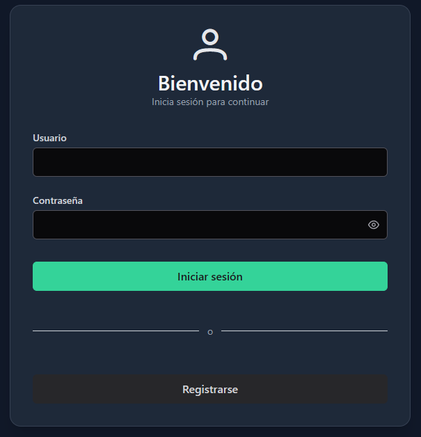
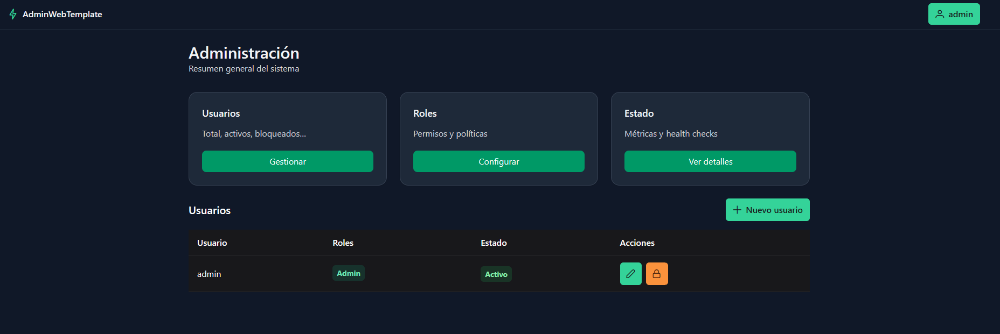
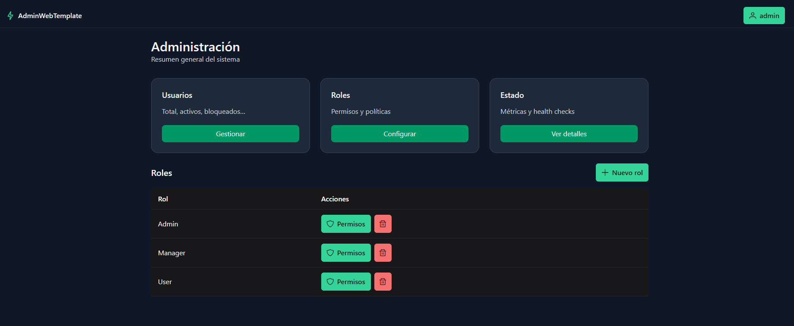
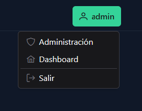

# AdminWebTemplate

Template full-stack listo para arrancar en 2 minutos:

- **Frontend:** Angular 20 + PrimeNG + Tailwind v4 (sin `tailwind.config.js`, usando `tailwindcss-primeui`)
- **Backend:** .NET 8 Web API + Identity + JWT (claims `perm` y `role`)
- **Permisos:** policies por `perm` (ej. `admin:access`, `users:read`, `users:write`)
- **Demo:** SQLite en memoria (sin instalar nada), crea admin de prueba automáticamente

## Preview

<p align="center">
  <a href="docs/preview/login.png">
    
  </a>
  <br/>
  <a href="docs/preview/admin-users.png">
    
  </a>
      <br/>
  <a href="docs/preview/roles-permisos.png">
    
  </a>
    <br/>
  <a href="docs/preview/navbar.png">
    
  </a>
</p>

> Más capturas en [`/docs/preview`](docs/preview/).

## Quick Start (demo)

1. **Backend**

   - Abre `backend/AdminWebTemplate.API` en Visual Studio y ejecuta **Run**.
   - Se crea la BD en memoria y un admin demo:
     - Email: `admin@demo.local`
     - Password: `Demo123$`

2. **Frontend**
   ```bash
   cd frontend
   npm install
   npm start   # o: ng serve
   Abre http://localhost:4200 y accede con las credenciales demo.
   ```

Para persistencia real (SQLite archivo o SQL Server), mira los README específicos:

Frontend → /frontend/README.md

Backend → /backend/README.md

Estructura
bash
Copiar
Editar
/frontend/ # Angular (standalone + OnPush + strict)
/backend/ # .NET 8 API (API + Infrastructure + Migrations)
Seguridad
No subas claves ni cadenas reales: usa User Secrets / variables de entorno.

.gitignore ya ignora _.db, _-wal, _-shm, appsettings._.json de entornos, etc.

Créditos y atribución
Licencia MIT: conserva el aviso de copyright y esta licencia.
Se agradece (y se recomienda) un crédito visible en proyectos públicos:

Built with Admin Web Template by Juan Carlos (enlace a este repositorio).
